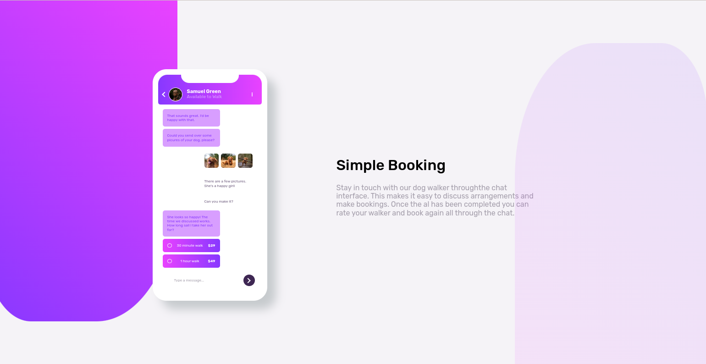

# Frontend Mentor - Chat app CSS illustration solution

This is a solution to the [Chat app CSS illustration challenge on Frontend Mentor](https://www.frontendmentor.io/challenges/chat-app-css-illustration-O5auMkFqY). Frontend Mentor challenges help you improve your coding skills by building realistic projects. 

## Table of contents

- [Overview](#overview)
  - [The challenge](#the-challenge)
  - [Screenshot](#screenshot)
  - [Links](#links)
- [My process](#my-process)
  - [Built with](#built-with)
- [Author](#author)

**Note: Delete this note and update the table of contents based on what sections you keep.**

## Overview

### The challenge

Users should be able to:

- View the optimal layout for the component depending on their device's screen size

### Screenshot

### Links

- Solution URL: [GitHub Respository](https://github.com/jaac97/Chat-app-CSS-illustration)
- Live Site URL: [GitHub Pages](https://jaac97.github.io/Chat-app-CSS-illustration/)

## My process

### Built with

- Semantic HTML5 markup
- CSS custom properties
- Flexbox
- Desktop-first workflow
- Block Element Modifier

## Author

- LinkedIn - [Josué Alarcón Camino](https://www.linkedin.com/in/josue-alarcon-camino/)
- Frontend Mentor - [@jaac97](https://www.frontendmentor.io/profile/jaac97)

